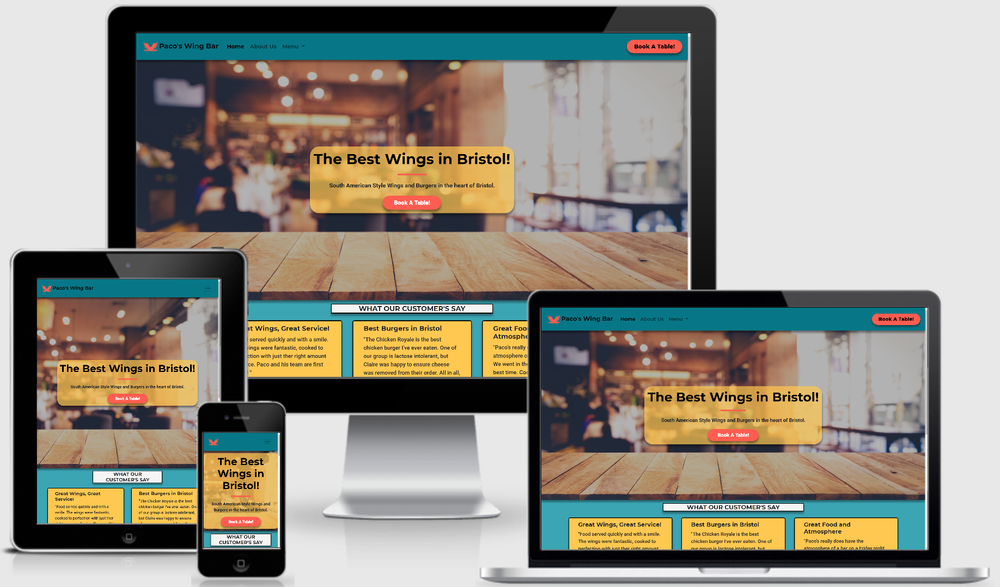
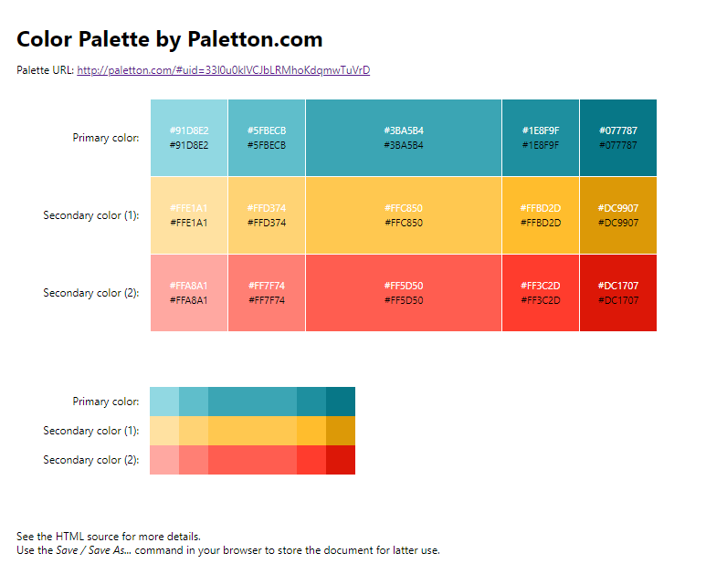

# Milestone 1 - Paco’s Wing Bar - by Russell Oakham

## Project overview

The project is a small website for a restaurant based in Bristol. The sites main purpose is to get entice new or previous customers to book a reservation at the restaurant. The website promotes that the restaurant is a small independant business, whose menu is inspired by international street food. 

The live website can be found at the following link;
[Paco's Wing Bar](https://russoakham.github.io/ci-milestone-project-1/)

## 1. UX

Overview of UX decisions, structure etc. Examples of websites I have viewed as part of research & resulting UX design decisions.

### User Stories

 - As a business owner, I want to build awareness of the restaurant within Bristol, so as to attract new or returning customers.
 - As a business owner, I want to advertise the products we produce and culture of the business, so as to attract new or returning customers.
 - As a business owner, I want to offer the ability for customers to book a reservation online, to avoid unnecessary calls during busy hours.
 
 - As a user, I want a simple and clean looking website, so information is easy to digest and not overwhelming.
 - As a user, I want an easy to navigate website, to save time and avoid frustration.
 - As a user, I want to be able to access the website on desktop, tablet and mobile devices, to ensure high convenience.

 - As a user, I want to be able to get in contact with the restaurant, to be able to ask additional questions.
 - As a user, I want to know the opening hours and location of the restaurant, so I can easily find the premises on the day of reservation.
 - As a user, I want to know the products on offer and the price, so I can ensure the products are attractive and within my personal budget prior to visiting.
 - As a curious user, I want to know about the restaurant's culture, to ensure it aligns to my own ethics and/or desires.
 - As a curious user, I want to read reviews from other customers to the restaurant, to know if i should expect a positive experience
 - As a user, I want to be able to cater my booking for special occasions, so the restaurant is aware in advance.

### Structure
At this point I started thinking about what information, pages, features, and calls to action were too necessary and how they would be grouped.

I wanted to keep the structure simple, restricting design to 4-5 key content pages so potential customers would not feel overwhelmed or 'spammed' by irrelevant information. I identified key content pages to be;

- Home Page: Containing brief overview of restaurant ethos, call-to-action (book online), location and contact details.
- About Us: Containing more in depth explanation of restaurant ethos, culture, menu inspiration, team members of unique selling points.
- Menu: Containing current menu propositions of the restaurant, allowing potential customers a view of what the restaurant offers and at what prices. Taking a transparent approach to this will increase customer loyalty.
- Online Booking: Page to enable customers to submit table reservation requests.

- [Site Map](/workspace/ci-milestone-project-1/wireframes/site-map.pdf)

### Skeleton
At this point I began creating proper wireframes, considering how the User will navigate through the site, what content has priority, and interrelation of content. I used [Balsamiq](https://balsamiq.com/) to create the below wireframes:

 - [Home page on mobile and desktop wireframe](/workspace/ci-milestone-project-1/wireframes/home-desktop-mobile.pdf)
 - [About Us page on mobile and desktop wireframe](/workspace/ci-milestone-project-1/wireframes/about-us-desktop-mobile.pdf)
 - [Menu page on mobile and desktop wireframe](/workspace/ci-milestone-project-1/wireframes/menu-desktop-mobile.pdf)
 - [Online Reservation page on mobile and desktop wireframe](/workspace/ci-milestone-project-1/wireframes/menu-desktop-mobile.pdf)

### Surface
This is the sensory design section of a website, or how it looks, feels and sounds. I wanted the design to be clean and the colour scheme to be light and refreshing. 

#### Colour
As the restaurant is inspired by South American and international street food, I was keen to choose a colour scheme reminiscent of South America. With this in mind, I chose to use a predominantly blue, yellow and red colour scheme. These colours feature strongly in the flags of South American countries, as well as their sporting colours - e.g. Argentina, Brazil, Colombia and Costa Rica.

Additionally, the colours blue, yellow and red evoke the emotional responses I would like to evoke in potential customers. According to [this article on 99 designs](https://99designs.co.uk/blog/tips/how-color-impacts-emotions-and-behaviors/), the colours I've chosen evoke the following responses;

 - Blue: Safety and Relaxation
 - Yellow: Happy and Spontaneous
 - Red: Passionate and Energised.

 These emotions should help promote the fresh and exciting feel of the street food menu we wish to convey, while exciting potential customers to make a booking.

 Once I'd chosen the colour scheme, I chose to use the sky blue tone found in the Argentinian flag (#74ACDF) as a starting point and input this to [palleton](https://paletton.com/). As I felt this original blue was slightly too pale, I played with the colour until I found a more vibrant blue I felt was fitting to the aesthetic feel I wanted. I decided upon using Blue hex code #3BA5B4.

 To complement my colour scheme I chose the 'triad' option on my palleton which provided me with two supplementary colours, blue and yellow, which I made additional small tweaks to. 
 
 The complete colour scheme provided by palleton is below, including paler/brighter options.

  

#### Language/Tone 
I wanted the language to reflect the casual and fun atmosphere of the restaurant, so content was written in line with this. Avoiding technical or formal language where possible.

#### Styling Considerations
Before beginning development, I listed some styling ideas that I felt benefit the website. Majority of these can be seen in the wireframes.

 - Favicon: Desktop and Mobile.
 - Menu: 
    - Card design, which reacts to mouse hover (transform: Zoom) to add a level of interaction and excitement to products.
    - Ability to download pdf version of menu in printable format for customer convenience.
 - Navigation
    - Sticky top
    - Mobile: 'Burger' menu icon, expanding on click.
    - Logo: Navigates to home page on click.
 - Location: Embed Google Map iframe showing restaurant location.

## 2. Features
This section describes how user achieve what they need interacting with the website;

### Existing Features
#### **The Header** includes:
 - **Restaurant Name and Logo**: Builds brand awareness amongst users.
 - **Navigation Bar**: Allows users to navigate the site in an easy and intuitive way.
 - **'Book A Table!' Button**: Ensures 'call-to-action' button is present on user screen at all times, allowing easy navigation to booking page to users.

 #### **The Footer** includes:
 - **Hero Statement** - Short statement describing the restaurants identity.
 - **Opening Hours** - Restaurant opening hours for customer convenience
 - **Contact Us** - Contact details for customer convenience including email and telephone.
 - **Book A Table** Link - Additional 'call-to-action' link directing to reservation page.
 - **Menu** Download Link - Addtional link to download pdf version of menu for customer convenience.
 - **Social Links** - Links to restaurants various social media pages.

 Both the Header and Footer are present and consistent on all website pages.

 #### **Home** page includes:
 - **Image Banner with call to action button** - Visually pleasing design and allows customers to make a reservation as soon as they enter the site.
 - **What out Customers Say** - Testimonials from previous customers, to build repute with new or returning users.
 - **Our Location** - Addres and opening hours for restaurant, plus embedded visual Google Map location. To allow customers to easily locate physical premises.

#### **About Us** page includes:
 - **About Paco's** - Allows users to learn of restuarants history, philosophy and culture.
 - **Our Team** - Allows users to learn background of key staff members, building familiarity between users and staff.

 #### **Menu* page includes:
 - **Restaurants Menu** - A description of all items on the menu at the moment. Each menu card includes an image of the dish, ingrediants used and price. Where appropriate additional information regarding spice levels are included.

 #### **Reserveration** page includes:
 - **Reservation Form** - Allows users to submit a booking request online, providing name, contact details, time, date, party size and optional additional information.

 **Favicon**: Present on every page and in the form of business logo, allows users to identify the site by just seeing the icon on tab.

### Features to consider implementing in future.
 - Social Media Feed - Instagram, Twitter, Facebook
 - Integration with third party delivery platforms such as deliveroo and uber eats.
 - Booking Form: 
    - Provide different booking times across weekends/weekdays to allow varied opening times.
    - Connect to database, to store contact details for further marketing activities.
    - Provide e-mail confirmation of bookings.
 - Video(s): Video promoting the restaurant, including short interviews with team members and clips of the restaurant during service.
 - Blog: Blog posts to promote seasonal items and changes to the menu.
 - Embedded Ratings: Tripadvisor and Google star ratign embedded on homepage to further promote website brand.

## 3. Technologies Used
1. [HTML](https://en.wikipedia.org/wiki/HTML) - Programming language providing content and structure of website.
2. [CSS](https://en.wikipedia.org/wiki/CSS) - Programming language providing styling of website.
3. [Bootstrap CSS Framework](https://getbootstrap.com/) - Library of pre-built HTML and CSS components, used for various aspects of the site, such as navigation bar.
4. [Font Awesome](https://fontawesome.com/) - Library used for icons, such as social links and heat chillis.
5. [Google Fonts](https://fonts.google.com/) - Used to choose a font style for the website.
6. [TinyPNG](https://tinypng.com/) & [TinyJPG](https://tinyjpg.com/): To minimise image file sizes and maximise page load speed.
7. [ResizePixel](https://www.resizepixel.com/) - To manipulate image size and dimensions.
8. [Real Favicon Generator](https://realfavicongenerator.net/) to generate favicons and icons for desktop and mobile usage.
9. [Am I Responsive?](http://ami.responsivedesign.is/) used for responsive design demo in ReadMe summary.
10. [GitHub](https://github.com/) - Remote hosting platform and code repository.
11. [GitPod](https://gitpod.io/) - IDE (Integrated Development Environment), for writing, editing and saving code.
12. [Balsamiq](https://balsamiq.com/) - Used for creation of wireframes for visual design testing.
13. [Autoprefixer](https://autoprefixer.github.io/) - Used to add vendor prefixes to CSS rules.
14. [Responsive Design Checker](https://www.responsivedesignchecker.com/) - Used to check website response across device types.
15. [BrowserStack](https://www.browserstack.com/) - Used to check website response across device types.

## 4. Testing
The testing process can be seen in the [TESTING.md](TESTING.md) document.

## 5. Deployment

### Github Pages
The site is hosted using GitHub pages, deployed directly from the master branch of GitHub. The deployed site will update automatically as new commits are pushed to the master branch.

#### How I deployed my project to GitHub pages.
To host on GitHub pages you must follow these steps:

1. Go to [GitHub.com](https://github.com/)
2. Login to my account.
3. Click on 'Responsitories'
4. Click on 'CI-Milestone-Project-1'
5. Go to the 'Settings' tab
6. Scroll down to the 'GitHub Pages' section and set the source to 'Master Branch'. This turns on GitHub pages for the repository.
7. Reload the page. Scroll back to 'GitHub Pages' section, where the new URL for the deployed site can be found.

Additional information around these steps can be found on the [GitHub Pages Help Page](https://docs.github.com/en/github/working-with-github-pages/creating-a-github-pages-site).

#### Hot to clone 'CI-Milestone-Project-1' in GitHub and GitPod.
To run a version of the site locally, you can clone this repository using the following steps;

In a code editor of your choice;

1. Go to [GitHub.com](https://github.com/)
2. Login to my account.
3. Click on 'Responsitories'
4. Click on 'CI-Milestone-Project-1'
5. Click on the 'Code' button.
6. Under 'HTTPS' click the clipboard icon to the right of the URL.
7. In your IDE of choice, open repository or create a new repository.
8. Open Terminal ('Terminal' then 'New Terminal' from top ribbon menu in GitPod.)
9. Type 'git clone', paste URL link and press enter.

Additional information around these cloning steps can be found on [GitHub Pages Help Page](https://docs.github.com/en/github/creating-cloning-and-archiving-repositories/cloning-a-repository).

## 6. Credits

### Design and research
The following sites are websites that I used for reference and inspiration:
The following are sites I used for reference and inspiration:
- [Burger Theory](https://burgertheory.co.uk/)
- [Backyard Chicken Company](https://www.backyardchicken.co.uk/)
- [Randy's Wing Bar](https://randyswingbar.co.uk/)
- Colour Selection
    - 99 designs [https://99designs.ie/blog/tips/how-color-impacts-emotions-and-behaviors/]
- Menu Card Format
    - [Nandos](https://www.nandos.co.uk/food/menu/index.html)
in solving technical issues:
- Team Card Format: [Kevin Bourke Milestone 1](https://bourkekev.github.io/ms1-music-school/about.html)

### Technical
The following sites are websites I used to assist in solving technical issues:
- Google Map Embed: [Google Developers](https://developers.google.com/maps/documentation/embed/get-started)
- [Real Favicon Generator](https://realfavicongenerator.net/): For generation of Favicon icons and code.
- [Bootstrap Docs](https://getbootstrap.com/docs/5.0/getting-started/introduction/): For guidance on Bootstrap use and adaptations.
- [CSS-Tricks](https://css-tricks.com/): For implementing CSS effects such as box-shadow.
- [w3Schools](https://www.w3schools.com/): For checking proper syntax of HTML and CSS elements. 
- [Autoprefixer] - For generating CSS browser prefixes.

### Content
All text content on the site was written originally by myself, with the below notes;
- **Customer Testimonal's** - Inspired and adapted from [Tripadvisor](https://www.tripadvisor.co.uk/) reviews of various restaurants.
- **About Us** - Adapted from [Burger Theory](https://burgertheory.co.uk/##burgers) about us content.
- **Menu** - Inspired and adapted from items on following restaurant menus;
    - [Burger Theory](https://burgertheory.co.uk/)
    - [Backyard Chicken Company](https://www.backyardchicken.co.uk/)
    - [Randy's Wing Bar](https://randyswingbar.co.uk/)

### Media
The photos and images used for this site were obtained from;
 - **[Canva](https://www.canva.com/)**:
    - Menu Template (Vernon Street)
    - Logo image.
- **[Shutterstock](https://www.shutterstock.com/)**: From the following Photographers
    - Madrugada Verde
    - Sion Hunnuna
    - Cabeca de Marmore
    - StockCreations
    - Olga Moroz
    - DronG
    - Hakin Mhan
- **[Unsplash](https://unsplash.com/)**: From the following Photographers
    - Alex Motoc
    - Louis Hansel
    - Jennifer Burk
    - Sheri Silver
    - Jarritos Mexican Soda
    - Proriat Hospitality
    - Klara Kulikova
    - Artharva Tulsi
    - Natalie Vojsner
    - Julia Joppien
    - Fabien Zakaria
    - Vince Fleming
    - Mario: @wondermario
    - Timothy Barlin

### Acknowledgements

 - Thanks to my mentors Anthony Ngene and Precious Ijege for their suggestions, time and support.
 - Thanks to those on Slack for reviewing my project and making suggestions:
 - Thanks to my housemates, friends and family for reviewing the project and offering constructive feedback.