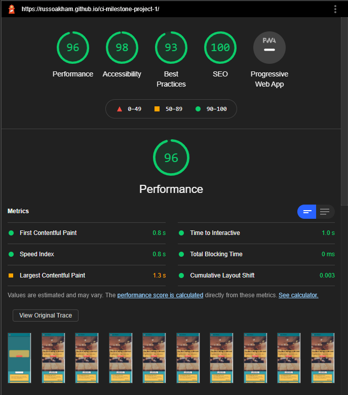
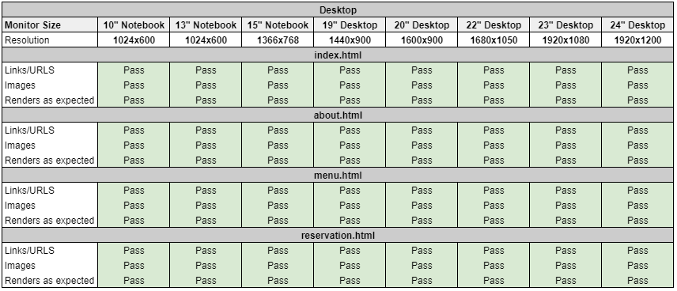
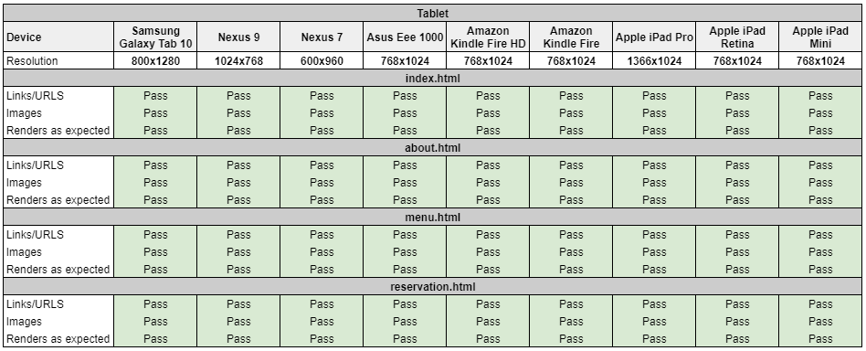
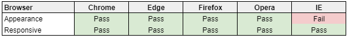
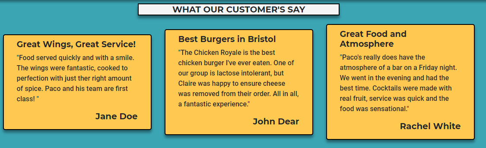
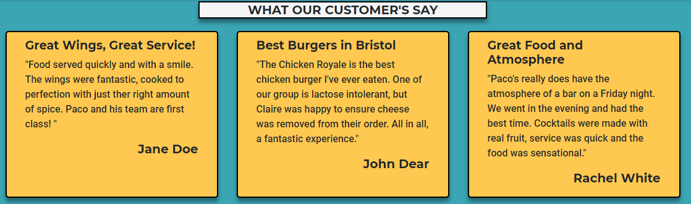

# 
Testing for [Paco's Wing Bar](https://russoakham.github.io/ci-milestone-project-1/)

## Validation

### W3 HTML
I validated the HTML with [W3 Validation Service](https://validator.w3.org/). The results can be seen below;
 - [index](design-resources/testing/HTML/before/home.PNG)
 - [about us](design-resources/testing/HTML/before/about-us.PNG)
 - [menu](design-resources/testing/HTML/before/menu.PNG)
 - [reservation](design-resources/testing/HTML/before/reservation.PNG)

 **Errors**
 The reservation form section showed an error at first, this is because the option is marked as "required", as the first option must either have an empty 'value' attribute or have no text content. The fix to this is to add a 'disabled value' showing placeholder text.

 **Warnings**
 All pages showed warnings regarding HTML semantics and use of H1's and H2-6's in sections, however upon review I am happy that all headings are relevant and each page has a relevant unique H1. So I decided not to enact any changes. 

### W3 CSS 
I also validated the CSS with the [w3 Validation Service](https://jigsaw.w3.org/css-validator/) and it found no errors.

Screenshots for Final Validations passes can be seen below;
 - HTML:
    - [index](design-resources/testing/HTML/after/index.PNG)
    - [about us](design-resources/testing/HTML/after/about.PNG)
    - [menu](design-resources/testing/HTML/after/menu.PNG)
    - [reservation](design-resources/testing/HTML/after/reservation.PNG)
 - CSS: [style.css](design-resources/testing/CSS/css-validation.PNG)

### Google Lighthouse Audit
I used Google's lighthouse audit to test the website conforms positively with Google's performance metrics, with the aim of achieving scores of 90 in all areas on desktop.

After initial testing, the performance metric was below 90, while Accessibility, Best Practices and SEO were low 90's. To improve this i carried out the below actions;

**Performance** - Converted all images from .jpg/.png to .webP, which offers improved compression and therefore quicker loading times. I used the website [caniuse](https://caniuse.com/webp), to ensure webp is compliant with all major web browsers, which it is with exception of Internet Explorer. I've detailed the reasoning for accepting non-compliance with Internet Explorer in the **responsiveness** section.

**Accessibility** - Added rel="noopener" and rel="noreferrer" to social media links in footer, to improve security and avoid passing of any site information to external sites.

**Best Practices** - Added a 'title' to google map iframe, for improved semantics.

**SEO** - Added meta descriptions for all pages providing an overview of page content and intent.

These changes improved all metrics to the below passing scores;

## Responsive Browser & Device Testing
To test the responsiveness of the site I used [Chrome DevTools](https://developers.google.com/web/tools/chrome-devtools), [Responsive Design Checker](https://www.responsivedesignchecker.com/) and [BrowserStack](https://www.browserstack.com/).

### Responsiveness

I found only a few small issues related to small mobile device viewport.

The first issue was content overflowing the yellow content boxes, such as the opening hours table. To rectify this I included an additional small viewport media query to reduce padding of yellow content boxes to 20px left and right, and remove column padding in tables.

The second issue was the call-to-action container on the homepage banner, which covered almost the entire banner image. To improve this I added a small screen size media query reducing margin and padding to the following css classes; 'hero-callout p','hero-header' and 'heading-divider'. These changes allowed more of the background image to be visible and improved the overall aesthetic.

### Browser Compatibility

The site works well on all browsers except for Internet Explorer, which fails to load the images due to not supporting the webP image format.

According to [caniuse](https://caniuse.com/usage-table) the current usage of Internet Explorer is just 1.1% or total browser users, therefore I am comfortable to not support IE in the site design.

Note: Microsoft released Internet Explorer in 2013 and ceased active development in 2015, when Microsoft Edge was released as it's replacement, as evidenced by [this article](https://techcommunity.microsoft.com/t5/windows-it-pro-blog/the-perils-of-using-internet-explorer-as-your-default-browser/ba-p/331732) from Microsoft's design team. Since 2015 Microsoft has been actively encouraging users to adopt Edge over Explorer, with the only remaining updates for IE, being security patches and bug fixes.

## Testing User Stories
- As a business owner, I want to build awareness of the restaurant within Bristol, so as to attract new or returning customers.
    - When the user is navigating the site, they'll see the brand logo and restaurant pictures at the top of each page.
    - The site also has a favicon depicting the restaurant logo, that makes the website recognisable while looking at browser tabs and bookmarks.
    - On the **About** page the user can see pictures of all key team members, including the owner.
    - On the **Menu** page the user can see pictures of all dishes served by the restaurant.
    - On the **About** page the user can read that all ingrediant's are sourced locally.

 - As a business owner, I want to advertise the products we produce and culture of the business, so as to attract new or returning customers.
    - On the **Menu** page the user can see pictures of all dishes served by the restaurant.
    - On the **About** page the user can read that all ingrediant's are sourced locally.
    - On the **About** page the user can learn of the inspiration behind the restaurant's founding and menu.

 - As a business owner, I want to offer the ability for customers to book a reservation online, to avoid unnecessary calls during busy hours.
    - On the **Reservation** page the user can find a booking form to complete online.
    - On the **Home** page there is a 'Book A Table!' call-to-action button in the centre of the top banner, this navigates to the reservation page.
    - To the right of the **Navigation** bar there is a 'Book A Table' call-to-action button, this is present on all pages and navigates to the reservation page.
 
 - As a user, I want a simple and clean looking website, so information is easy to digest and not overwhelming.
    - Users view the site and can see the layout is simple, well spaced and consistent across all pages. Images are of high quality, but styled so as not to be distracting. All text and descriptions are kept brief, to allow easy digestion of information.
    - Users are engaged by the bright, exciting colour scheme, which contrast also allows easy reading of all text elements.

 - As a user, I want an easy to navigate website, to save time and avoid frustration.
    - On all pages of the website, the simple navigation bar is fixed to the top of the page, which allows easy navigation to all other pages of the website. When scrolling, the navigation bar remains at the top of the viewport, for easy access.

 - As a user, I want to be able to access the website on desktop, tablet and mobile devices, to ensure high convenience.
    - Users who are browsing on Chrome, Safari, Microsoft Edge or Firefox can use the website on desktop, tablet and mobile devices with full responsiveness.
 
 - As a user, I want to be able to get in contact with the restaurant, to be able to ask additional questions.
    - The user can navigate to bottom of every page, where the **footer** displays contact details for the restaurant.

 - As a user, I want to know the opening hours and location of the restaurant, so I can easily find the premises on the day of reservation.
    - On the **Home** page, the opening hours and location for the restaurant are clearly shown, including embedded google map iframe for the premises.
    - The opening hours and address can also be found in the **footer** for every page.

 - As a user, I want to know the products on offer and the price, so I can ensure the products are attractive and within my personal budget prior to visiting.
    - On the **Menu** page, all products have images, description and price information. Additional information such as spice level, are included where appropriate.

 - As a curious user, I want to know about the restaurant's culture, to ensure it aligns to my own ethics and/or desires.
    - On the **About** page, users can read a short summary of the restaurants founding, menu inspiration and ingredient sourcing. Users can also read short biographies for key team members.

 - As a curious user, I want to read reviews from other customers to the restaurant, to know if i should expect a positive experience
    - On the **Home** page, users can review testimonials of previous customers, gauging their enjoyment of the restaurant.

 - As a user, I want to be able to cater my booking for special occasions, so the restaurant is aware of additional requirements in advance.
    - On the **Reservation** page, users can provide additional information regarding their booking via the 'Additional Info:' textbox on the booking form.

## Issues I had to overcome
Overall production of the site was smooth, where I only encountered a few small issues;

- **Homepage Banner**: On the home page, the yellow banner slightly blended into the background due to the background's natural yellow hew. To remove this blending, I added a 'box-shadow' effect via CSS to provide a natural effect border. I liked the effect so much, I've applied this to other elements throughout the site.

- **Yellow Content Box & Team-Card Sizing**: Due to the content of the various boxes being different lengths, the yellow boxes and team-cards would size differently on various viewport sizes. This gave a messy look, as evidenced below;

To ensure a clean look, I wanted to ensure all elements were uniform in size. To enable this I added a 'min-height' css rule to the '.yellow-content-box' class, plus additional media-queries using bootstrap breakpoints, to ensure uniform height across devices.

- **Google Map iframe**: Similar to the yellow-content-boxes, I had to add media-queries to the iframe embedding the google map, to ensure this resized in line with it's partnered yellow content box. As the google map element is sized by the 'padding-bottom' css rule, I had to use this rather than 'min-height'.

- **logos and menu pdf**: As this is a new business, I had to create an original logo and menu. To accomplish this I used [Canva](https://www.canva.com/), which provided templates I was able to adapt. I used the colours as noted under the 'UX' section to ensure they aligned to branding.

- **Favicons**: I used [Real Favicon Generator](https://realfavicongenerator.net/) to create favicon images, for use across Windows, iOS and Android based devices.
The generator does advise the files be placed directly into the website root, however for file cleanliness I decided to place these in a [sub-directory](assets/images/favicons). After testing, it appears to not have caused an issue and favicons are working correctly.

- **Team Card Images**: The images on the team card would stretch vertically when viewed on a thin screened device, such as my iPhone XR. This is because the images were under the "card" classes 'display: flex' and 'flex-direction: column" rules. To rectify this, I wrapped the images in their own div and used this as my styling class (team-profile-image) for the images. 

- **Bootstrap Console Error**: Upon loading the deployed site, Chrome DevTools showed an error loading some Bootstrap scripts. This was because jQuery is a prerequisite for Bootstrap functionality and I was loading Bootstrap first. To rectify this, I moved the jQuery script to the first position of HTML scripts.

## Issues still to overcome
- **Online Reservation Form**: Currently the form allows booking for the restaurant's static open hours of 12pm-10pm Monday-Sunday. However, to allow the restaurant to open different hours throughout the week and also to close for certain days (e.g. christmas), the form needs to be updated to allow dynamic updates of available times depending on date/day.
To achieve this I would need to implement javascript to the form, which is currently outside my expertise.
Alternatively, I'd advise the client to partner with a third party provider who provides online booking solutions such as [Opentable](https://www.opentable.co.uk/). This could then be directly embedded to the booking page, allowing the owners to easily update booking availability without the need of developer support and ensure future function stability.